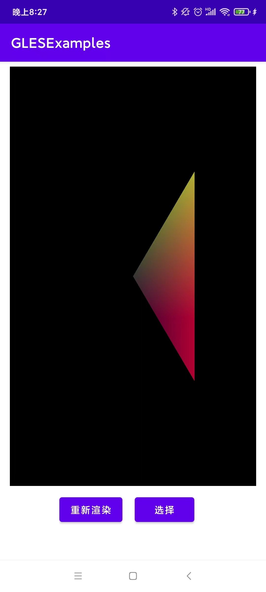
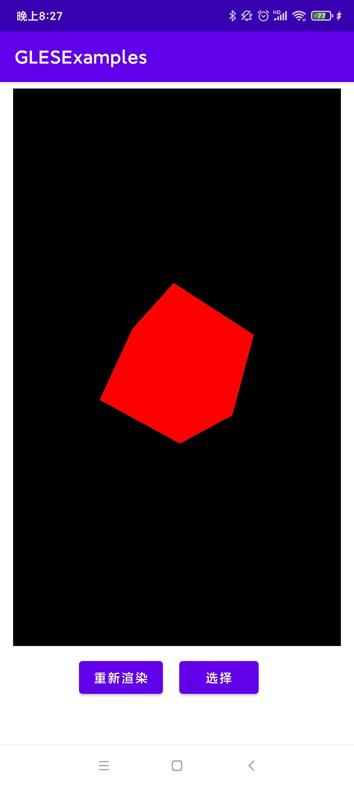
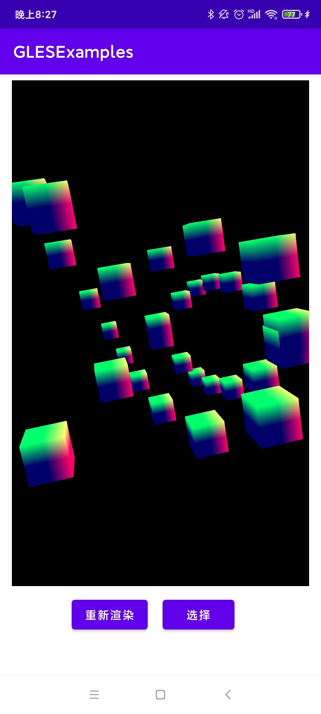
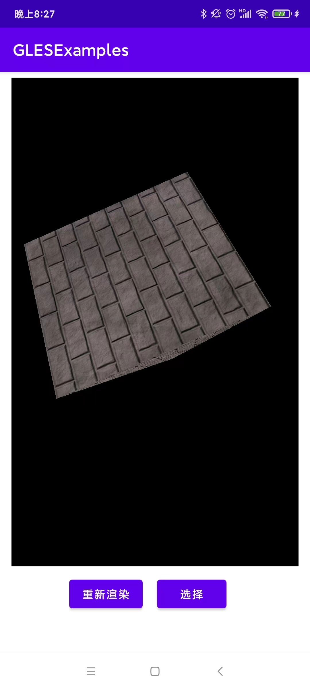
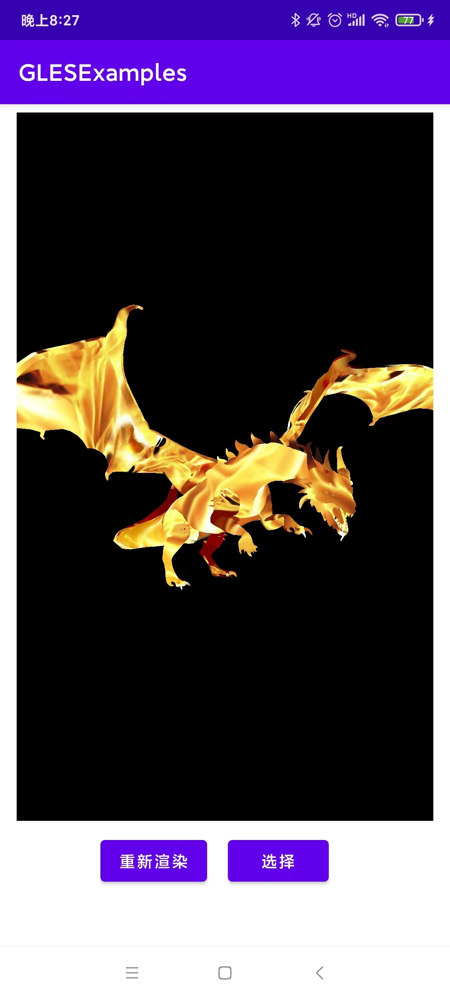
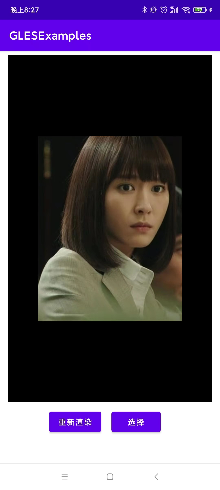
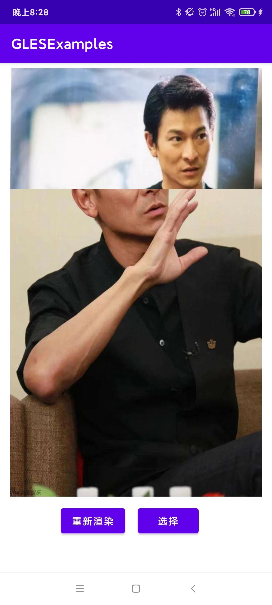
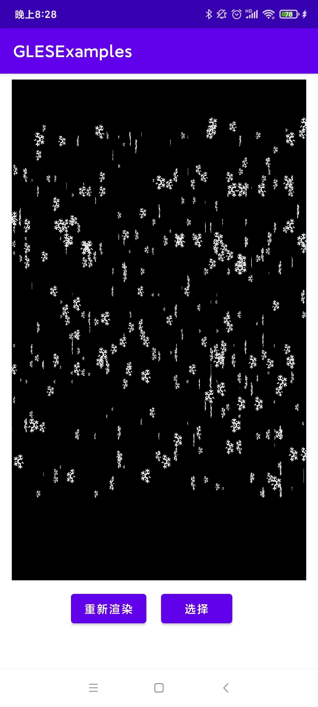

# GLESExamples

## 项目简介
本项目是基于opengles3 开发的demo, 主要目的在于入门 Opengles 渲染。具体效果见B站：https://www.bilibili.com/video/BV1aY4y167Eh?spm_id_from=333.999.0.0

## 开发环境
· Android 10 + java 1.8 + ndk24\
· 测试机器: Redmi k30 Pro\
· glm

## 几种效果介绍

### 三角形

### 立方体

### 多个立方体

### 金字塔 + 纹理

### 加载 obj 对象

### YUV 图像渲染

### 图像交替

### 下雪

